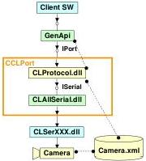
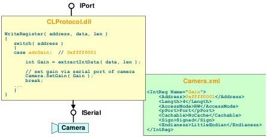

|  GEN<I>CAM |   |  emva  |
| --- | --- | --- |
|  V1.2 | CLProtocol Standard Module  |   |

## 1 Overview

This module of the GenICam standard describes how to configure a Camera Link \( ^{®} \) camera using the GenApi module of the GenICam standard. The Camera Link specification does not define cameras to be register-based. Instead, the Camera Link configuration interface is based on an ISerial interface which allows sending and receiving blocks of bytes. The GenICam GenApi module however requires an IPort interface which allows getting and setting registers in the camera.

The CLProtocol module defines the interface of a Camera Link protocol driver library (hereinafter referred to as CLProtocol driver library) which must be provided by the camera manufacturer. The CLProtocol driver library must implement an IPort interface using the ISerial interface as connection to the camera (see Figure 1).

Figure 1 Using the CLProtocol driver library to configure a camera

If a camera is natively register-based the CLProtocol driver library is just a simple protocol driver running for example a binary register access protocol like the CANbus protocol. If however a camera is for example ASCII-based the CLProtocol driver library must implement a pseudo register space and provide the corresponding camera description XML file (see Figure 2Figure 3).

Figure 2 Providing a pseudo register space

This CLProtocol driver library has a pure C interface and is normally not used directly. Instead, the GenICam reference implementation provides the CLProtocol module which comes with a C++ wrapper class CCLPort deals with tasks like loading and binding of the best matching driver library (see Figure 1). The wrapper class