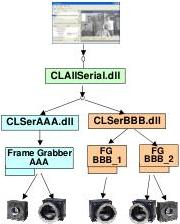

|  GEN<i>CAM |   |  emva  |
| --- | --- | --- |
|  V1.2 | CLProtocol Standard Module  |   |

CLProtocol driver library returns a full DeviceID string unambiguously identifying the camera found connected to the port.

The connection for probing is normally performed at 9600 baud which is by definition of the Camera Link standard the wake up baud rate of cameras. A CLProtocol driver library can optionally implement baud rate auto detection.

Note that any automatic detection of the baud rate typically takes place in the probe step only. When a camera is later re-connected the baud rate is the same are detected in the probe step. The idea is that all time consuming procedures are performed in the probing step and the connection step is made as fast as possible. In order for this to work the CLProtocol driver library must remember the baud rate settings. It can do so because there is a Cookie which is handed out by the probing function and needs to be given to the connect function.

For circumstances where the time consuming probe step needs too much time, e.g. closing the application while probing is active, the CLProtocol driver library may implement the stop probing flag. This flag is called from another thread to immediately abort the current probe procedure (see section 6.2).

#### PortIDs

Before the probing can take place the user has to select a frame grabber port. The ports are enumerated using the CLAllSerial module and the result is presented in form of a list of PortID strings unambiguously identifying a port in the system.

The CLAllSerial module first enumerates all CLSerXXX modules found installed in the system, then it enumerates all frame grabber boards per module and finally all port per frame grabber board (see Figure 3). The PortID system however hides this enumeration hierarchy and presents the result of the enumeration process as a flat list of PortIDs.

Figure 3 How the CLAllSerial module enumerates frame grabber ports

The enumeration process differs depending on the operating system used. The following search patterns are used when looking for CLSerXXX modules:

• Windows Release Version: clser??? .dll
• Windows Debug Version: clser???d.dll
• Linux Release Version: clser??? .so
• Linux Debug Version: clser???d.so

When CLAllSerial module loads under Windows, it will search for the CLSerXXX modules in the directory of the CLALLSerial module itself and in the following described directory:

For 32-bit and 64-bit Windows the appropriate version of CLSerXXX module should be in the directory defined in the registry key:

HKEY_LOCAL_MACHINE\software\cameralink