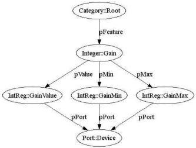

|  GENICAM |   | emva  |
| --- | --- | --- |
|  Version 2.1.1 | Standard  |   |

Figure 4 Example of the control flow when getting and setting features

If the user reads the value of the Gain node, the call will be dispatched to the GainValue node, which will in turn use the IPort interface from the Device node to ask for the right register.

If the user attempts to set the value of the Gain node, the implementation might decide to check the range first by reading the Min and Max values from the corresponding GainMin and GainMax nodes. If the value is inside the allowed range, the Gain node then will write it via the GainValue node and the Device node to the camera. Note that the implementation might cache the Min and Max values depending on the Cacheable attribute of the corresponding IntReg nodes.

### 2.5 Access Mode

Each node has an access mode defined according to the following table:

|  Readable | Writable | Implemented | Access Mode  |
| --- | --- | --- | --- |
|  * | * | 0 | NI – not implemented  |
|  0 | 0 | 1 | NA – not available  |
|  0 | 1 | 1 | WO – write only  |
|  1 | 0 | 1 | RO – read only  |
|  1 | 1 | 1 | RW – readable and writable  |

A feature may be implemented in a camera, but be temporarily not available. If it is available, then it is, by definition, also implemented and may be readable and/or writable.