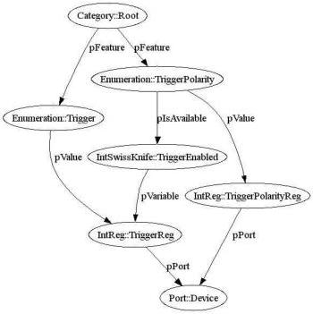

|  GEN<i>CAM |   |  emva  |
| --- | --- | --- |
|  Version 2.1.1 | Standard  |   |

Figure 5 Controlling whether a feature is accessible

The TriggerPolarity node has a pIsAvailable link that needs to point to a node exposing an Integer interface. If the value of this node is zero, the node is temporarily not accessible. \( ^{4} \)

In the example, pIsAvailable could directly point to TriggerReg because Trigger=On is mapped to 1 and Trigger=Off is mapped to 0. If this is not the case, a node of the IntSwissKnife type comes in handy. It computes an integer result from any number of other integer nodes using a mathematical formula. In the XML file, the node looks like this:

<IntSwissKnife Name="TriggerEnabled">
    <ToolTip>Determines if the Trigger feature is switched on</ToolTip>
    <pVariable Name="TRIGGER">TriggerReg</pVariable>
    <Formula>TRIGGER==1</Formula>
</IntSwissKnife>

The mathematical formula in the <Formula> entry is evaluated, yielding the result of the node. Before the evaluation, the symbolic names of the variables are replaced by the integer values of the corresponding nodes. In the example, there is only one <pVariable> entry pointing to the TriggerReg node and having the symbolic name TRIGGER. This is also found in the formula that reads “TRIGGER==1”.</pVariable></pVariable>

So if the graphical user interface is updated, it will ask the TriggerPolarity node whether it is enabled. The TriggerPolarity node will in turn check the IntSwissKnife, which will in turn compute the outcome from the value of the TriggerReg node.