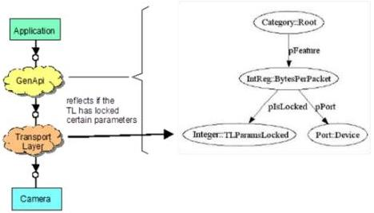

|  GENICAM |   |  emva  |
| --- | --- | --- |
|  Version 2.1.1 | Standard  |   |

The BytesPerPacket feature of DCAM compliant 1394 cameras is a typical example for making a feature temporarily locked. The user can change this camera parameter, but only if the DMA of the PC adapter card is not yet set up for grabbing. \( ^{5} \)  Setting up the DMA means that the transport layer asks the camera for the BytesPerPacket parameter and configures that value to the DMA. After this has been done, BytesPerPacket must not be changed until the transport layer releases the DMA. In the meantime, the parameter must be locked in the camera.

Note that the camera itself has no way of knowing whether the DMA is set up or not. As a consequence, the “normal” nodes in the camera description files cannot be used for controlling the lock status of BytesPerPacket.

Figure 6 Locking a feature

The solution within GenApi is to provide a floating Integer node TLParamsLocked (see Figure 6). The BytesPerPacket links to this node with a pIsLocked link. The transport layer (TL) needs to reflect its DMA status by updating the value of the TLParamsLocked node. Before it sets up the DMA, it locks the respective camera parameters (e.g., BytesPerPacket) by setting TLParamsLocked to 1, and after the grab has been finished, it sets TLParamsLocked 0 again. Changing the TLParamsLocked node will in turn update the lock status of all dependent nodes, for example, the BytesPerPacket node.

Note that in order for this scheme to work generically, TLParamsLocked must be a standard node name and the transport layer must have access to the GenApi interface of the camera. In addition, the designer of the camera description file must be aware of which parameters will be locked by the transport layer. This information is included in the transport layer standard,