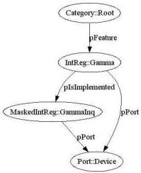

|  GENICAM |   |  emva  |
| --- | --- | --- |
|  Version 2.1.1 | Standard  |   |

e.g., the DCAM specification, which specifies that during grab the number of packages per frame and the package size must be fixed.

A family of cameras where some members have a Gamma feature implemented and some do not is a typical example for a feature being not implemented. If the cameras have an inquiry bit advertising whether the camera has the Gamma feature implemented or not, you can maintain one camera description file for the whole family of cameras.

Figure 7 shows how to handle that case with GenICam. The Gamma feature node has a pIsImplemented link to a GammaInq node mapping to the inquiry bit in the camera. Multiple inquiry bits are typically packed into one register. For extracting the bits, the MaskedIntReg node type is used. It works like an IntReg node, but in addition, you can denote which bit or which contiguous group of bits you want to be extracted as an integer.

Figure 7 Checking whether a feature is implemented

### 2.6 Caching

If an implementation supports checking ranges, presence, and enable status for each write access, it would normally trigger a cascade of read accesses to the camera. However, most of the values required for validation do not change frequently or at all and can thus be cached. The camera description file contains all of the necessary means to ensure the cache's coherency.