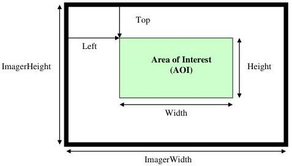
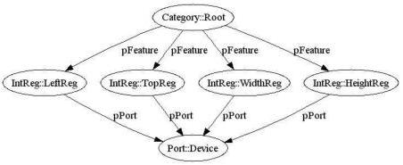

|  GEN<ICAM |   | emva  |
| --- | --- | --- |
|  Version 2.1.1 | Standard  |   |

Figure 8 Area of Interest

To explain this, a more elaborate example must be used. Figure 8 shows an area of interest (AOI) on the imager in a camera. The camera will send only the data from within the AOI, which is given as a rectangle defined by the parameters Top, Left, Width, and Height.

Figure 9 Controlling the Area of Interest

Each of these four parameters is exposed through a register as shown in Figure 9. This simple scheme, however, cannot deal with the fact that none of the four parameters has an unlimited range. Assuming that the pixel coordinates start with 0, the following restrictions apply:

\(0 \leq Left \leq ImagerWidth - Width\)  
\(0 \leq Top \leq ImagerHeight - Height\)  
\(1 \leq Width \leq ImagerWidth - Left\)  
\(1 \leq Height \leq ImagerHeight - Top\)