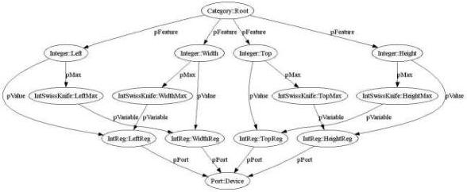

|  GENICAM |   | emva  |
| --- | --- | --- |
|  Version 2.1.1 | Standard  |   |

To take these restrictions into account, the maximum values for each of the four parameters must be computed using SwissKnife nodes; the minimum values are fixed. The resulting GenApi node graph is shown in Figure 10. Note that a second layer of Integer nodes has been introduced and that the maximum values are taken from IntSwissKnife nodes.

Figure 10 Controlling the Area of Interest while taking restrictions into account

Assuming an imager with VGA resolution (640x480), the XML code for the TopMax node might look like this:

<IntSwissKnife Name="TopMax">
    <pVariable Name="CURHEIGHT">HeightReg</pVariable>
    <Formula>480-CURHEIGHT</Formula>
</IntSwissKnife>

Returning to the topic of caching, you would not want the HeightReg to be read each time you set the Left feature, nor would you want the TopMax node to be evaluated each time. This is indeed not necessary if (and only if) you are certain that HeightReg will only change when the GenApi itself writes a new value to that register. If this is the case, you can cache the values of HeightReg and TopMax.

If the user writes a new value to HeightReg, the HeightReg cache can be updated immediately, and the TopMax cache needs to be invalidated. The next time someone accesses the Left node, it will read TopMax, thereby creating a new cache entry for TopMax.

As a rule, all clients of a node are informed if the node changes its content so that the clients can invalidate their caches.

Normally, the links between the nodes in the camera description file contain all of the information needed so that the implementation can deal with the caching without the user needing to worry about it. However, there are certain cases were the camera itself contains more dependencies than those directly described by the nodes.