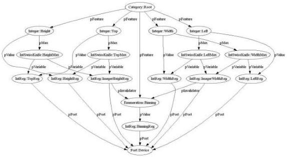

|  GENICAM |   |  emva  |
| --- | --- | --- |
|  Version 2.1.1 | Standard  |   |

Some cameras contain a feature called Binning. When Binning is switched on, the charge from adjacent pixels is merged together, yielding a larger full well at the cost of lower resolution. Assuming a VGA resolution imager, typical configurations are:

• No Binning (640 x 480)
• Horizontal Binning (320 x 480)
• Vertical Binning (640 x 240)
• Full Binning (320 x 240)

In GenICam, this feature would be described using an enumeration with the four entries given above (see Figure 11). However, changing the binning also means changing the imager size – not the real physical imager, but rather the logical imager size that imposes the restrictions on the AOI parameters.

Figure 11 Controlling the Area of Interest taking binning into account

Let's assume that the camera provides the information about the current (logical) imager size with a register. As shown in Figure 11, this introduces two new nodes: ImagerHeightReg and ImagerWidthReg. The XML code for TopMax then looks like this:

<IntSwissKnife Name="TopMax">
    <pVariable Name="CURHEIGHT">HeightReg</pVariable>
    <pVariable Name="IMAGERHEIGHT">ImagerHeightReg</pVariable>
    <Formula>IMAGERHEIGHT-CURHEIGHT</Formula>
</IntSwissKnife>

As we have seen, the value of ImagerHeightReg will change if the user changes the Binning feature. However, there is no data flow between the two nodes. To make sure that the node