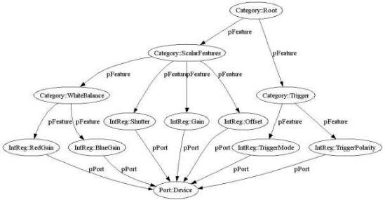

|  GENICAM |   |  emva  |
| --- | --- | --- |
|  Version 2.1.1 | Standard  |   |

<Category Name="Root" NameSpace="Standard">
    <pFeature>ScalarFeatures</pFeature>
    <pFeature>Trigger</pFeature>
</Category>

<Category Name="ScalarFeatures">
    <pFeature>Shutter</pFeature>
    <pFeature>Gain</pFeature>
    <pFeature>Offset</pFeature>
    <pFeature>WhiteBalance</pFeature>
</Category>

<Category Name="WhiteBalance">
    <pFeature>RedGain</pFeature>
    <pFeature>BlueGain</pFeature>
</Category>

<Category Name="Trigger">
    <pFeature>TriggerMode</pFeature>
    <pFeature>TriggerPolarity</pFeature>
</Category>

Note that a user accessing the nodes by browsing the category tree is intended only to see features nodes in the first layer below the Category nodes. Nodes deeper in the graph are called implementation nodes and are retrievable only by name or in a special browse mode that the implementation might provide for debugging purposes. Note that the names and the layout of the implementation nodes may change without notice in a new release of a camera description file, even if the vendor declares it backward compatible (see also section 2.7.3).

Figure 12 A tree of categories