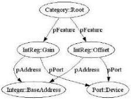

|  GENICAM |   |  emva  |
| --- | --- | --- |
|  Version 2.1.1 | Standard  |   |

Figure 13 Indirect addressing: mapping a C/C++ struct

Note that this mechanism is used very frequently with 1394 DCAM compliant cameras where the whole standard register block has a common base address that must be parsed from a IEEE 1212 configuration ROM structure at run-time (see also the ConfRom node type).

#### 2.8.4 Arrays and Selectors

Indirect addressing as described in the previous chapter is also used for accessing arrays. The following example shows how this is done (see also Figure 14):

<Integer Name="LUTIndex">
    <Value>0</Value>
    <Min>0</Min>
    <Max>255</Max>
    <pSelected>LUTEntry</pSelected>
</Integer>

<IntReg Name="LUTEntry">
    <IntSwissKnife Name="LUTEntryAddress">
    <pVariable Name="INDEX">LUTIndex</pVariable>
    <Formula>0xff00 + INDEX * 4</Formula>
    </IntSwissKnife>
    <Length>4</Length>
    <AccessMode>RW</AccessMode>
    <pPort>Device</pPort>
    <Sign>Unsigned</Sign>
    <Endianess>LittleEndian</Endianess>
</IntReg>

A LUT Entry element is used as a pointer into the LUT. The address of this element is computed using an embedded  \( \langle IntSwissKnife\rangle \)  element that computes the address of the LUTEntry element according to the formula:  \( BaseAddress + LUTIndex \cdot sizeof(LUTEntry) \) . The LUTIndex is a “floating” Integer node that is not connected to the camera. Instead, it starts with  \( \langle Value\rangle \)  and can be changed between  \( \langle Min\rangle \)  and  \( \langle Max\rangle \)  by the user.