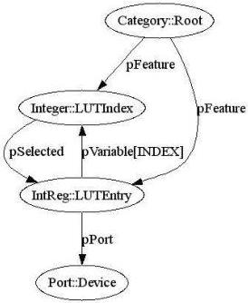

|  GEN<I>CAM |   |  emva  |
| --- | --- | --- |
|  Version 2.1.1 | Standard  |   |

Figure 14 Accessing a LUT array

The fact that the LUTIndex can be used to select a specific LUTEntry is made explicit by the <pSelected> element in the LUTIndex node. Nodes implementing an IInteger or and IEnumeration interface can have any number of pSelected entries to indicate that the selected nodes will show a different value depending on the value of selector node. Information whether a node is a selector and which are the selected nodes can be retrieved using the ISelector interface which has the according methods IsSelector and GetSelectedFeatures. Using this interface a GUI can for example show a list of LUTEntries because it knows that if it runs LUTIndex (selector) from min to max it will retrieve an array of different values from LUTEntry (selected).

Note that the selector and the indirect addressing scheme can also be used to access multi-dimensional arrays via multiple indices.

#### 2.8.5 Integer, IntReg, MaskedIntReg

The IInteger interface provides access to signed 64 bit integer variables that have a Value restricted by the Minimum, Maximum, and Increment parameters according to the formulas:

\[
\text { Value } = \text { Minimum } + i \cdot \text { Increment }
\]

with

\[
0 \leq i \leq \frac {\text { Maximum } - \text { Minimum }}{\text { Increment }}
\]

The IntReg node maps to byte-aligned integer registers. It inherits the elements and attributes from Register nodes. Below is an example mapping to a 2 byte unsigned integer.