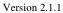

|   CAM |   |  emva  |
| --- | --- | --- |
|  Version 2.1.1 | Standard  |   |

HISTORY

|  Version | Date | Changed by | Change  |
| --- | --- | --- | --- |
|  1.0 | 13.06.2006 | Fritz Dierks, Basler | Released version as voted on during the Montreal meeting  |
|  1.1 draft 1 | 25.03.2008 | Fritz Dierks, Basler | First draft for version 1.1  |
|  2.0 | 06.11.2009 | Fritz Dierks, Basler | Released  |
|  2.0.1 | 17.10.2013 | Fritz Dierks, Basler | Fixed some minor miss-spellings and added some clarifications  |
|  2.1 | 30.09.2015 | Fritz Dierks, BaslerRene Weber, Baumer | - Added a description of default values which are either already given in the schema or in the reference implementation- Added ValidValueSet- Added clarifications provided by Eric Bourbonnais, Dalsa  |
|  2.1.1 | 18.01.2016 | Fritz Dierks, BaslerMattias Josefsson, Sick | - Fixed several typos  |