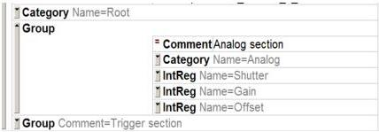

|  GEN<ICAM |   |  emva  |
| --- | --- | --- |
|  Version 2.1.1 | Standard  |   |

A chunk port can have an element <CacheChunkData> which can have the values Yes and No. If chunk data caching is enabled a copy of the chunk data is held even if the corresponding buffer is detached.</CacheChunkData>

#### 2.8.17 Group element

The <Group> element helps to make a large camera description file more readable. The element can be used to bundle blocks of nodes together as shown in the following example:</Group>

<Category Name="Root">
    <pFeature>Analog</pFeature>
    <pFeature>Trigger</pFeature>
</Category>

<Group Comment="Analog section">
    <Category Name="Analog">
    <pFeature>Shutter</pFeature>
    <pFeature>Gain</pFeature>
    <pFeature>Offset</pFeature>
    </Category>

    <IntReg Name="Shutter">
    <!-- more elements -->
    </IntReg>
    <IntReg Name="Gain">
    <!-- more elements -->
    </IntReg>
    <IntReg Name="Offset">
    <!-- more elements -->
    </IntReg>
</Group>

<Group Comment="Trigger section">
    <!-- more elements -->
</Group>

A typical XML editor will be able to hide the contents of a group as shown in the following screen shot:

The <Group> node has a Comment attribute, which is displayed by the editor when the group is folded away. Groups can be nested in any depth. They do not have any meaning with respect of the functionality of the camera. If the camera description file is interpreted, they are just stripped off.</Group>