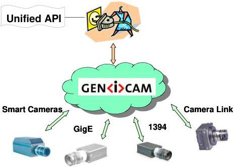

|  GEN<i>CAM |   |  emva  |
| --- | --- | --- |
|  Version 2.1.1 | Standard  |   |

## 1 Overview

Today's digital cameras are packed with much more functionality than just delivering an image. Processing the image and appending the results to the image data stream, controlling external hardware, and doing the real-time part of the application have become common tasks for machine vision cameras. As a result, the programming interface for cameras has become more and more complex.

The goal of GenICam is to provide a generic programming interface for all kinds of cameras. No matter what interface technology the cameras are using or what features they are implementing, the application programming interface (API) should be always the same (see Figure 1).

Figure 1 The GenICam vision

The GenICam standard consists of multiple modules according to the main tasks to be solved:

- GenApi : Application programming interface (API) for configuring a camera
- GenTL : API for transport layer (TL) that allows grabbing images
• SFNC : Standard Feature Naming Convention
- CLProtocol : API for interfacing Camera Link camera to GenAPI.