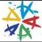

|   CAM |   |  emva  |
| --- | --- | --- |
|  Version 2.1.1 | Standard  |   |

## 4 Acknowledgements

The following companies and individuals have participated in the elaboration of the GenICam Standard:

|  Company | Represented by  |
| --- | --- |
|  Basler | Friedrich Dierks (editor GenApi), Hartmut Nebelung, Margret Albrecht, Alexander Happe  |
|  Baumer | Rene Weber  |
|  Teledyne DALSA | Eric Bourbonnais, Eric Carey  |
|  e2v semiconductors | Frédéric Mathieu  |
|  JAI Pulnix | Karsten Ingeman Christensen, Loai Zeineh, Michael Krag  |
|  Leutron Vision | Stefan Thommen, Jan Becvar  |
|  Matrox Imaging | Stephane Maurice  |
|  MVTec Software | Christoph Zierl, Milan Rüder  |
|  National Instruments | Johann Scholtz, Eric Gross  |
|  Pleora | Alain Rivard, Francois Gobeil, Vincent Rowley  |
|  Stemmer Imaging | Rupert Stelz (editor Transport Layer), Sascha Dorenbeck  |
|  |   |

## 5 Rights and Trademarks

The European Machine Vision Association owns the "EMVA, GenICam Standard Compliant" logo. Any company can obtain, free of charge, a license to use the "EMVA GenICam Standard Compliant" logo either for cameras that include a GenICam compliant camera description file of for software supporting the interpretation of GenICam compliant camera description files.

Licensees guarantee that they meet the terms of use in the relevant version of the EMVA GenICam standard. Licensed users will self-certify the compliance of their cameras and/or software with which the "EMVA GenICam Standard Compliant" logo is used. The licensee must check compliance with the relevant version of EMVA GenICam standard at least once a year. When displayed online, the logo must be featured with a link to EMVA standardization web page.

EMVA will not be liable for implementations that do not comply with the standard or for damage resulting there from. EMVA reserves the right to withdraw the granted license at any time without giving reasons.