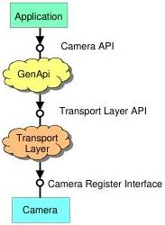

|  GEN<ICAM |   |  emva  |
| --- | --- | --- |
|  Version 2.1.1 | Standard  |   |

## 2 GenApi Module – Configuring the Camera

### 2.1 Introduction

The GenApi module deals with the problem of how to configure a camera. The key idea is to make camera manufacturers provide machine readable versions of the manuals for their cameras. These camera description files contain all of the required information to automatically map a camera's features to its registers.

A typical feature would be the camera's gain and the user's attempt might be, for example, to set Gain=42. Using GenICam, a piece of generic software will be able to read the camera's description file and figure out that setting the Gain to 42 means writing a value of 0x2A to a register located at 0x0815. Other tasks involved might be to check in advance whether the camera possesses a Gain feature and to check whether the new value is consistent with the allowed Gain range.

Note that adding a new feature to a camera just means extending the camera's description file, thus making the new feature immediately available to all GenICam aware applications.

Figure 2 Layers for accessing a camera

Figure 2 shows the layers involved in configuring a camera. The application requires a camera API that allows dealing with the camera's features, for example, by writing code which looks like this:

Camera.Gain = 42;

The GenApi module will translate this call into a series of calls to register access functions provided by the transport layer API, for example, like this:

TransportLayer.WriteRegister(0x0815, 0x2A, 2); // address, data, length