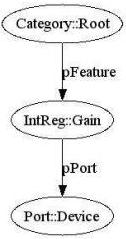

|  GENICAM |   |  emva  |
| --- | --- | --- |
|  Version 2.1.1 | Standard  |   |

Finally, the transport layer will deliver the calls to the camera interface. GenApi currently assumes that the camera is configured using a flat register space.

The GenICam standard defines the syntax of the camera description file plus the semantics of the transport layer API. In addition, the GenICam standard recommends – but does not enforce – the usage of certain names and types for common features such as Gain or Shutter.

The standard does not contain the actual code for reading the description file and translating features to registers, nor does it contain the transport layer code. Everyone is free to do their own implementation. There is, however, a reference implementation available that can be freely used.

Note that the GenApi section in this document deals with the camera description file only. It is intended to help the GenICam user to understand the key ideas behind the GenApi module and to enable people to write their own camera description files. The GenApi reference implementation comes with a reference manual showing how an end user can use the GenApi module even without a deeper understanding of the concepts laid out in this section.

### 2.2 Basic Structure of the Camera Description File

The camera is described by means on an XML file containing a set of nodes with each node having a type and a unique name. Nodes can link to each other and each connection plays a certain role. Figure 3 shows a very simple example in graphical notation. The nodes are shown as bubbles labeled "type::name," and the links are shown as arrows labeled with the role name.

There are two special nodes: the Root node from which one can start walking the node graph and the Device node that provides the connection to the transport layer. \( ^{1} \)

Figure 3 Topology of a graph constructed from a simple configuration file