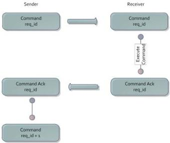

|  GEN<i>CAM |   |  emva  |
| --- | --- | --- |
|  Version 1.3.1 | GenCP Standard  |   |

Fig. 1 – Command Cycle

One entity, such as the host, sends a command with a given request_id to the other entity, such as the device, on a channel. The device processes the command, if requested forms an acknowledge packet and sends that back to the command sender. Command and acknowledge must have the same request_id. After the completion of a cycle, a different request_id must be used for the next cycle. It is up to the implementation to pick its request_id. It is recommended that at the start of a communication the command sender starts with a request_id = 0 and increments it by 1 with every new command cycle. If the request_id wraps around, it is recommended to wrap to 1 in order to prevent a second use of request_id = 0. In case the same request_id is received a second time in consecutive commands the device should either send a pending ack (see below), if the command is still being processed, or resend the acknowledge in case the final ack for the original command has already been sent.

The exception to the just described “acknowledge resend” rule is  \( request\_id = 0 \) . For  \( request\_id = 0 \)  it is only allowed to send read commands (for example reading the GenCP Version registers) which do not change the device state. This read command must always be executed because  \( request\_id = 0 \)  and a new ack is to be sent. The data being sent must not come from an “old” cache. In case a  \( request\_id = 0 \)  is sent containing a write command the device must return a GENCP_INVALID_PARAMETER status code. Since the host application does not necessarily know which register changes the device’s state it is recommended to read register 0 (GenCP Version) for that.