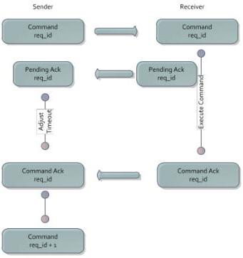

|  GEN<i>CAM |   |  emva  |
| --- | --- | --- |
|  Version 1.3.1 | GenCP Standard  |   |

#### 3.1.2. Pending Acknowledge

In case the processing of a command takes longer than specified in the Maximum Device Response Time register, the command receiver must send a pending acknowledge. This pending acknowledge response uses the same request_id as the command, which triggered it, and provides a temporary timeout in milliseconds to be used only with the command currently executed. The command sender can then temporarily adjust its acknowledge timeout for the current cycle. In case the command receiver has the heartbeat enabled it has to suspend its heartbeat mechanism so that the device does not lose connection. In case the execution of the command takes longer than signaled through an already sent pending acknowledge, the command receiver may issue another pending acknowledge indicating a new, longer timeout.

Fig. 2 – Pending Ack Cycle

In case the device receives a further command packet while processing a command, it reacts as follows: