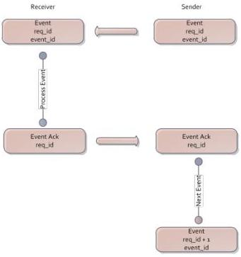

|  GEN<i>CAM |   |  emva  |
| --- | --- | --- |
|  Version 1.3.1 | GenCP Standard  |   |

#### 3.1.3. Message Channel

A Message Channel allows the asynchronous transfer of event commands from the device to the host. For each Message Channel a different channel_id from the default channel must be used.

Fig. 3 – Event Cycle

The channel_id to be used by the Message Channel is set by the host in the according register in the device's BRM. Multiple events can be transmitted in one event command. A single Event is identified by an event_id. An Event may be accompanied by additional event data. Subsequently sent event commands are identified by request_ids. One entity, such as the device, sends an event command with a given request_id to the other entity, such as the host, on a channel. The host acknowledges the event packet by sending an EventAck command back to the device. The event packet and the corresponding acknowledge must have the same request_id. After the completion of a cycle, a different request_id for the next cycle must be used. The request_id follows the schema described in section 3.1.1.