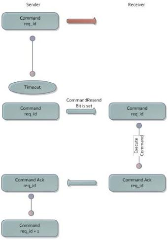

|  GEN<i>CAM |   |  emva  |
| --- | --- | --- |
|  Version 1.3.1 | GenCP Standard  |   |

##### 3.1.4.3. Command Packet Failure

If the command packet is lost on the link or if the command packet is received as corrupt, the following actions are supposed to happen:

Fig. 4 – Command Failure

The command is resent after the timeout period with the CommandResend bit being set. The request_id is the same as with the original command.