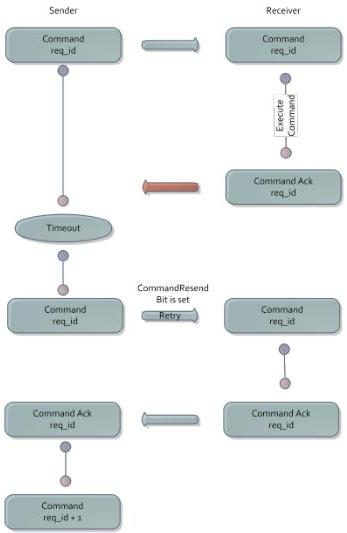

|  GEN<i>CAM |   | emva  |
| --- | --- | --- |
|  Version 1.3.1 | GenCP Standard  |   |

Fig. 5 – Ack Failure

In case of a corrupt acknowledge packet, the sender may issue the command resend immediately without waiting for the timeout.