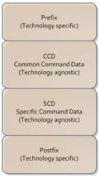

|  GEN<i>CAM |   |  emva  |
| --- | --- | --- |
|  Version 1.3.1 | GenCP Standard  |   |

## 4. Packet Layout

The protocol defines the communication between two entities. An entity is either a device or a host. The role of a device and host are defined by the initiator of the default communication. The host is the initiator of the communication on the default channel (see chapter 2.7) and the device responds to that.

### 4.1. General Packet Layout

The generic packet layout is divided into four parts:

Fig. 6 – General Packet Layout

- Prefix describes a technology specific section of the packet. This section covers

- Addressing
- Protocol type identification
- CRC
- channel_id etc.