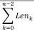

|  GEN<i>CAM |   | emva  |
| --- | --- | --- |
|  Version 1.3.1 | GenCP Standard  |   |

|  \( Len_1 \) | \( Len_0 \) | dataData read from the remote device's register map.  |
| --- | --- | --- |
|  ...  |   |   |
|  \( Len_{n-1} \) |  | dataData read from the remote device's register map.  |
|  Postfix  |   |   |

Table 14 – ReadMemStacked Ack SCD-Fields

If the number of bytes read is different than specified in the relating READMEM_STACKED_CMD, the status of the READMEM_STACKED_ACK must indicate the reason. In that case subsequent read requests from the according READMEM_STACKED_CMD are not executed by the receiver. The acknowledge only returns the data read correctly.

#### 4.4.8. WriteMemStacked Command

The WriteMemStacked command allows sending multiple write requests in one packet. Any write access start address and length is byte aligned unless the underlying technology states different rules. The number of bytes to write is deduced from the length field of the CCD header. The count of writes n within the packet has to be deduced by the receiver by parsing the packet up to the packet size sent by the transmitter.

|  Width (Bytes) | Offset (Bytes) | Description  |
| --- | --- | --- |
|  Prefix  |   |   |
|  CCD (command_id = WRITEMEM_STACKED_CMD)  |   |   |
|  8 | 0 | register address 064 bit register address of the first data block to write  |
|  2 | 8 | reservedReserved, set to 0  |
|  2 | 10 | length data block 0 (\( Len_0 \))Length of the first data block to write in bytes  |
|  \( Len_0 \) | 12 | dataFirst data block  |
|  8 | 12+\( Len_0 \) | register address 164 bit register address of the second data block to write  |