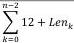
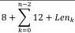
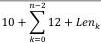
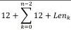

|  GEN<i>CAM |   | emva  |
| --- | --- | --- |
|  Version 1.3.1 | GenCP Standard  |   |

|  2 | \( 20+Len_0 \) | reservedReserved, set to 0  |
| --- | --- | --- |
|  2 | \( 22+Len_0 \) | length data block 1 (\( Len_1 \))Length of the second data block in bytes  |
|  \( Len_1 \) | \( 24+Len_0 \) | dataSecond data block  |
|  ...  |   |   |
|  8 |  | register address n-164 bit register address of the last data block to write  |
|  2 |  | reservedReserved, set to 0  |
|  2 |  | length data block n-1 (\( Len_{n-1} \))Length of the last data block in bytes  |
|  \( Len_{n-1} \) |  | dataLast data block  |
|  Postfix  |   |   |

Table 15 – WriteMemStacked Command SCD-Fields

#### 4.4.9. WriteMemStacked Acknowledge

The WriteMemStacked acknowledge states the result of a WriteMemStacked command.

|  Width (Bytes) | Offset (Bytes) | Description  |
| --- | --- | --- |
|  Prefix  |   |   |
|  CCD-ACK (command_id = WRITEMEM_STACKED_ACK)  |   |   |
|  2 | 0 | ReservedReserved, set to 0  |
|  2 | 2 | length 0 written (\( Len_0 \))Number of bytes successfully written to the remote device's register map. For WRITEMEM_STACKED_ACK it is mandatory to report the length written (different than with the WRITEMEM_ACK).  |