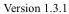

|  CAM |   | emva  |
| --- | --- | --- |
|  Version 1.3.1 | GenCP Standard  |   |

#### 5.4.9. Device Capability

Device capability bits describe implementation specific details.

|  Offset | Hex 1C4  |
| --- | --- |
|  Length | 8  |
|  Access Type | R  |
|  Support | M  |
|  Data Type | Bitfield  |
|  Factory Default | Implementation specific  |