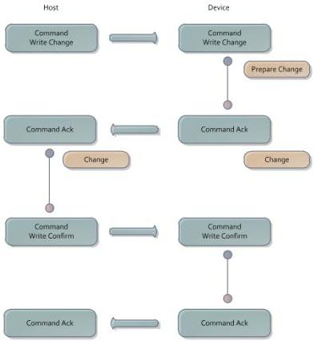

|  GEN<i>CAM |   |  emva  |
| --- | --- | --- |
|  Version 1.3.1 | GenCP Standard  |   |

Fig. 7 – Serial Parameter Change

The confirmation command rewrites the register which was written in the change step.

In case the device does not receive the confirming write command with the new parameters within 250 ms after sending the acknowledge, it falls back to the original parameter set.

In case the write confirm fails, the host must wait for 500 ms and then retry using the original parameter set.