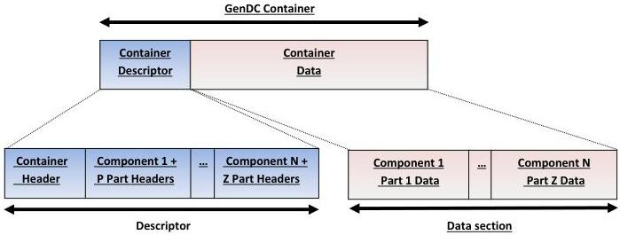

|  GEN<i>CAM |   | emva  |
| --- | --- | --- |
|  Version 1.1.0 | GenDC  |   |

## 2 GenDC Container

### 2.1 GenDC Container Layout

#### 2.1.1 GenDC Container General Layout

A GenDC Container is a self-described object that holds simple or complex arbitrary data buffers. The basic elements of a Container are the Descriptor and the data section (see Figure 2-1: GenDC Container Descriptor and Data). The Descriptor groups all the Headers describing the Container and the Components (including its Part(s)). In detail, the Descriptor has a Container Header followed by one or more Component Headers where each Component contains a single or multiple Part Headers. The data section consists of all the Part's data.

* N = Number of Components in the Container, P = Number of Parts in the Component 1, Z = Number of Parts in the Component N.

Figure 2-1: GenDC Container Descriptor and Data

A Container always starts with a unique, single Descriptor located first in the Container. However, to describe various Container transmission scenarios and allow preprocessing, this specification defines three kinds of Descriptors that the Transport Layers can use. All of them share the same layout but are typically sent at different points in time. The prefetch Descriptor is available before the streaming starts either from the XML or from the bootstrap registers of the transmitting device and describes all possible Components and Parts that can be received in the following acquisition phase. A Descriptor has to be sent as early as feasible during the acquisition in order to allow preprocessing of the data during the reception of the data. If the Container cannot vary during transmission, this Descriptor is called the final Descriptor giving complete and definitive information on the upcoming data. If the Container can vary during transmission a preliminary Descriptor should be sent first at the start of the transmission to allow preprocessing and must indicate which fields of the Component and Part Headers might change during transmission. In that case, a final Descriptor is sent at the end of the transmission and contains the final description of the Container's data. It shares the offset with the preliminary Descriptor and is therefore suitable to overwrite it.

#### 2.1.2 GenDC Container Headers Hierarchy

The Container Descriptor includes a Container Header that points to one or more Component Headers where each Component Header points to its constituting Part Header(s). Each of those Part Headers then points to their