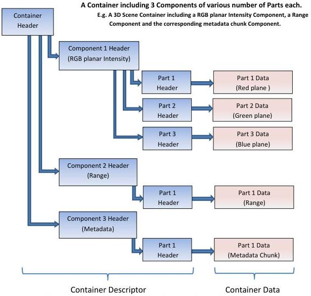

corresponding Part's data section.

## Data Container Descriptor Hierarchy (Headers and Data chaining)

Figure 2-2: GenDC Container Descriptor hierarchy in a multi-Components scenario (headers and data chaining)
(One Container of three Components with different number of data Parts)

## 2.2 GenDC Headers

The following subsections describe the Headers in detail. In the Header layout representations, there are fields that are common to all Containers or Components (grey background), fields that are common to all Parts (white background) and Part specific fields (light blue background). For each type of Header, a general layout is presented first giving an overview of the fields' names and placement (64-bit per line) followed by a detailed description of each Header's fields.