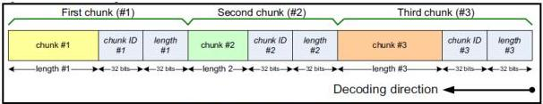

|  GENICAM |   | emva  |
| --- | --- | --- |
|  Version 1.1.0 | GenDC  |   |

chunk consists of the chunk data followed by a trailing tag.

The tag contains:

- A unique chunk identifier (4 bytes, little-endian), which identifies the structure of the chunk data and the chunk features associated with this chunk.
- The chunk data length (4 bytes, little-endian). Length is specified in bytes (excluding the tag itself) and must be a multiple of 4.

The chunk tags (chunk identifier and length fields) are headers embedded in the Part's data of the chunk block and their byte order is little-endian.

Example of GenICam Chunk Part data layout:

Figure 2-8: GenICam Chunk Part data layout

### GenDC Metadata Part Chunk Layout Id for GenICam Chunk

When the chunk layout (availability or position of individual chunks) changes in the chunk data Part, the Chunk "LayoutId" contained in the InfoTypeSpecific field of the GenICam Metadata Part header must change too. As long as the chunk layout remains the same, the Chunk LayoutId should stay identical. When switching back to a layout which was already used before, the same Chunk LayoutId that was used before or a new one can be used. A Chunk LayoutId value of 0 is reserved for Parts not supporting the layout Id functionality.

Note: The GDC_METADATA_GENICAM_CHUNK Part data can be decoded using the GenICam chunk parser class CChunkAdapterGenDC of the GenICam reference implementation.

### Container with Metadata Component including GenICam Chunk data.

In general, it is recommended that a Container contains only one common Metadata Component including one Part of type GDC_METADATA_GENICAM_CHUNK (and optionally its corresponding GDC_METADATA_GENICAM_XML Part to decode it). The Metadata Component and its Parts Format must be set to PFNC_Data8. If all the Container's Components have the same GroupId (the most common case), the Metadata Component must use this GroupId too.

If a Container contains many Component groups but the chunk data information about all those groups is located in a single common Metadata Component containing all the GenICam chunk data, then its GroupId must be set to 0xFFFF (which represent "pertains to all GroupId"). In that case, after chunk parsing using GenICam, the XML feature ChunkGroupSelector is typically used to target the information related to each particular group of Components.

GenDC also supports having many Metadata Components in the same Container each containing the GenICam chunk