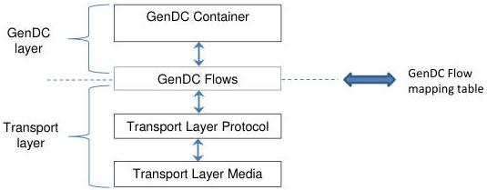

### 3 GenDC and Transport Layers

GenDC is agnostic to the Transport Layer and independent of it. To accomplish this, the notion of Flows is introduced as intermediate layer to decouple the Container content description from how it is transported and stored in receivers' memory.

Figure 3-1: GenDC layer and Transport Layer coupled by GenDC Flows

The top layer defines a GenDC Data Container and is the generic representation of a possibly complex data buffer to transmit/receive or that resides in memory. It is made of a group of standardized Headers called a Descriptor that gives the information about the Container itself, the Components and their individual Parts and describes the Container's data. This Container is "what" the device/system needs to generate, transmit, receive, store or manipulate the data. The Container definition and layout is self-described and independent of "how" it can be transported. For transmission the Container must use a linear memory layout. Example: a GenDC Container for 3D multi-Components image data.

GenDC Flows adapt the top and bottom layer. Both layers need to be aware of the Flows. GenDC describes the Flows and the Transport Layer provides means to transfer them. This way, it is possible to have a fully GenDC agnostic Transport Layer which can transport Flows even in parallel without further knowledge of the GenDC Container. The Transport Layer only needs to know how to transport and store Flows. To accomplish this, it is necessary to have a Flow table from the upper layer just giving the FlowID and FlowSize for each Flow in addition to a matching table of Flow base addresses which is given by the user or allocated by the Transport Layer itself. Example: Transfer of the GenDC Container sequential to one base address in one Flow.

The bottom layer is the Transport Layer (not in the scope of GenDC). It transports the GenDC Container as defined in the transport layer protocol based on the transport layer media. It typically takes care of data consistency and any other transport media related mechanism necessary for efficient and reliable data transmission. Example: GigE Vision protocol packets that transmit the GenDC Data Container on Ethernet.