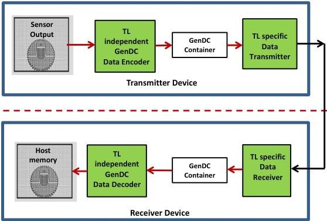

### 3.1 GenDC Typical Transmission and Reception

Figure 3-2: GenDC typical Transmission and Reception data handling

On the transmitter side, the Descriptor is typically encoded first and then passed with the Container's data to a transport layer specific data transmitter to be streamed out (possibly out of order). The receiver typically handles the GenDC Container by a transport layer specific data receiver. The reassembled Container is then passed to a GenDC decoder to be interpreted.

### 3.2 GenDC Flows

Flows allow the TL specific data transmitter and receiver to work without knowledge of the GenDC Container. Each Flow represents an independent memory transfer with a given size and identification number starting from zero. It is possible to transport the GenDC Container in a single Flow or in multiple Flows. In general, a Flow mapping table as shown in section 3.2.1 is sufficient for a Transport Layer to handle a GenDC Container. The receiver simply allocates buffer space for each Flow and does not need to know what is transported inside.

Arbitrary Parts of a GenDC Container can be transported in parallel to separate memory locations by using GenDC Flows. The relation between the GenDC Container, GenDC Flows and an arbitrary Transport Layer is shown in Figure 3-1. GenDC Flows allow the transport layer to reserve the necessary buffer space. In case the transport layer provides multiple Flows this also supports parallelism. Note that certain Transport Layer, Transmitter or Receiver might have limitations regarding parallelism.

The transfer of a GenDC Descriptor is always done in Flow zero. The GenDC Containers' Part(s) Header provides information about the FlowId and FlowOffset for all individual Parts. This optionally allows sending Parts on other Flows than Flow zero. Besides this, the GenDC Container is agnostic to Flows.