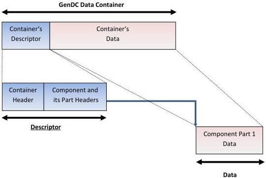

|  GENICAM |   | emva  |
| --- | --- | --- |
|  Version 1.1.0 | GenDC  |   |

## Appendix A GenDC Container Structure overview

In this section, a few examples of Container organization are represented. For a more exhaustive list of the Container format for the typical scenarios, see Appendix B.

### A.1 GenDC Container typical layout for monochrome or color packed 2D images.

#### GenDC Data Container typical layout :

(Monochrome or color packed 2D image)

Figure 5-1: GenDC Container's typical layout for a monochrome or color packed 2D image