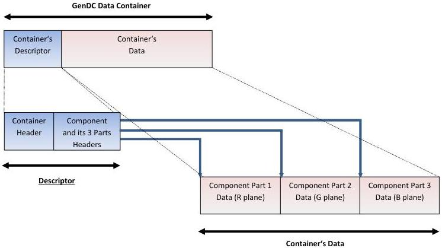

|  GENICAM |   | emva  |
| --- | --- | --- |
|  Version 1.1.0 | GenDC  |   |

### A.2 GenDC Container typical layout for color planar 2D images.

#### GenDC Data Container typical layout :

(Color RGB planar 2D Image)

Figure 5-2: GenDC Container's typical layout for a RGB planar 2D image