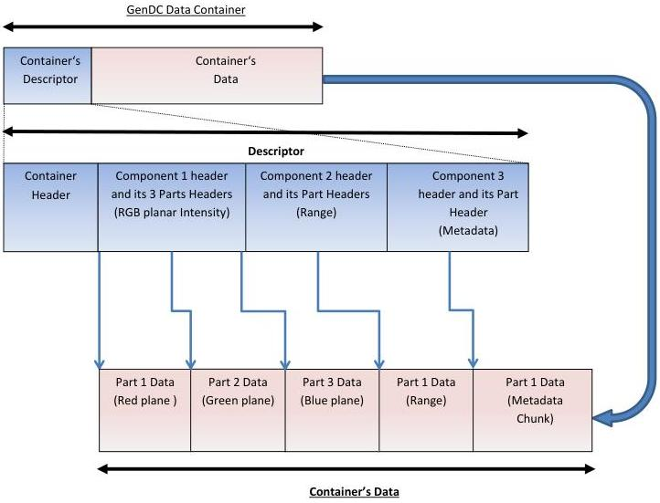

|  GENICAM |   | emva  |
| --- | --- | --- |
|  Version 1.1.0 | GenDC  |   |

### A.3 GenDC Container typical layout for a multi-Components 3D scene.

#### GenDC Data Container typical layout :

(A 3D Scene Container including a color RGB planar Intensity Component, a Range Component and the corresponding metadata chunk Component)

Figure 5-3: GenDC Container's typical layout for a multi-Components 3D scene with Intensity, Range and Metadata. (One Container of three Components with different number of data Parts)