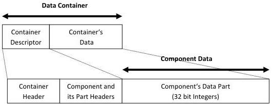
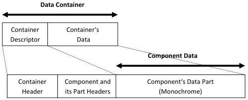

|  GENICAM |   | emva  |
| --- | --- | --- |
|  Version 1.1.0 | GenDC  |   |

## Appendix B Typical GenDC Containers layout

This section contains various examples of GenDC data Container layouts that can be used to represent typical Imaging data payloads.

### B.1 1D Array

1D Array Container including one Component of one data Part made of 32 bit integers.

1D Array Container (32 bits Integers):

Figure 5-4: 1D Array (32 bit Integers)

### B.2 2D Image (monochrome)

2D Image Container including one monochrome Intensity Component of one data Part.

2D Image Container (Intensity Mono):

Figure 5-5: 2D Image (monochrome 8 bit)