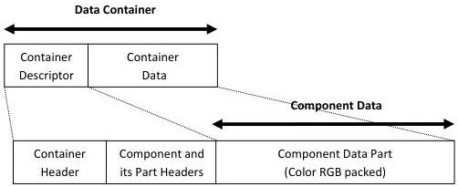
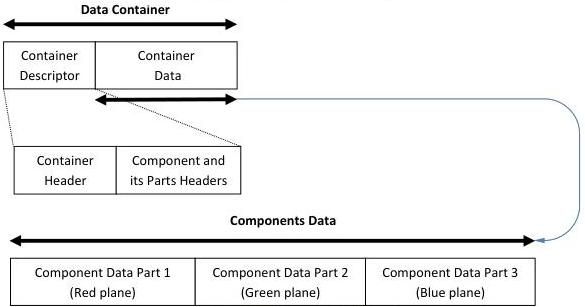

|  GENICAM |   | emva  |
| --- | --- | --- |
|  Version 1.1.0 | GenDC  |   |

### B.3 2D Image (color packed)

2D Image Container including one color Component that has one color Intensity data Part.

2D Image Container (Intensity RGB packed):

Figure 5-6: 2D Image (color RGB 32 bit packed)

### B.4 2D Image (color planar)

2D image Container including one color Component that has 3 monochrome data Parts.

2D Image (Intensity RGB planar):

Figure 5-7: 2D Image (color RGB planar)