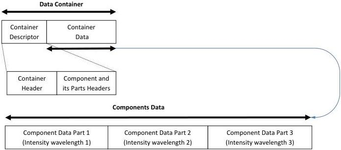

|  GENICAM |   | emva  |
| --- | --- | --- |
|  Version 1.1.0 | GenDC  |   |

### B.5 Multispectral Image (Intensity of multiple wavelength bands)

2D Image Container including one Multispectral Component of 3 wavelength planes. The Component has 3 data Parts each containing the data of a specific wavelength. Note that Container format is the same as RGB planar with one Plane/Part per wavelength band.

Multispectral Image planar:

Figure 5-8: Multispectral Image (3 wavelength planes)