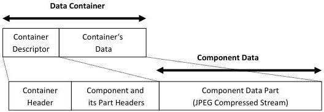

|  GENICAM |   | emva  |
| --- | --- | --- |
|  Version 1.1.0 | GenDC  |   |

### B.6 2D Image (Compressed)

2D Image Container including one color Component that has one JPEG compressed stream data Part.

2D Image Container (JPEG):

Figure 5-9: 2D Image (color JPEG)