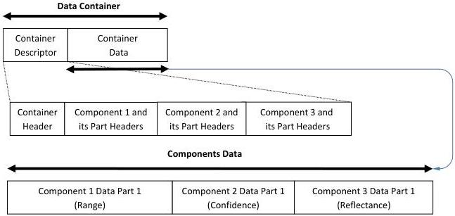

|  GENICAM |   | emva  |
| --- | --- | --- |
|  Version 1.1.0 | GenDC  |   |

### B.7 3D Image (Range, Confidence and Reflectance)

3D scene Container including 3 Components of one data Part each. The 3 individual Components can have different pixel formats.

3D Scene (Range, Confidence, Reflectance):

Figure 5-10: 3D Scene (range, confidence and reflectance)