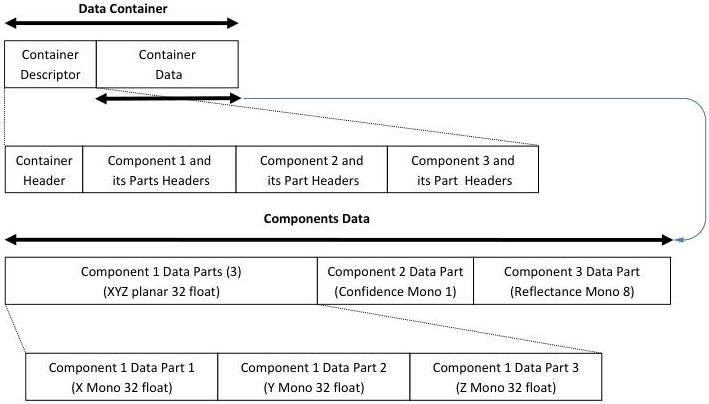

|  GENICAM |   | emva  |
| --- | --- | --- |
|  Version 1.1.0 | GenDC  |   |

### B.8 3D Image (X, Y, Z Planar Point Cloud, Confidence and Reflectance)

3D scene Container including 3 Components point cloud format. The XYZ Component is planar (3 separate data Parts) and the Confidence and Reflectance Components have one data Part each. The 3 Components can have different pixel formats.

3D Image (XYZ Planar Point Cloud, Confidence, Reflectance):

Figure 5-11: 3D Image (XYZ planar point cloud, confidence and reflectance)