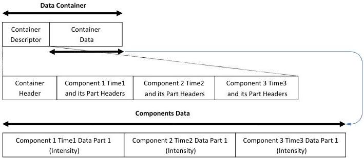

|  GENICAM |   | emva  |
| --- | --- | --- |
|  Version 1.1.0 | GenDC  |   |

### B.9 2D Image Sequence/Burst (Intensity of consecutive frames taken at different time)

2D Images Sequence Container including 3 Intensity Components. The Components have one monochrome data Part each and a unique Timestamp.

2D Images Sequence (3 consecutive frames with different timestamp)

Figure 5-12: 2D Image Sequence/burst (Intensity)