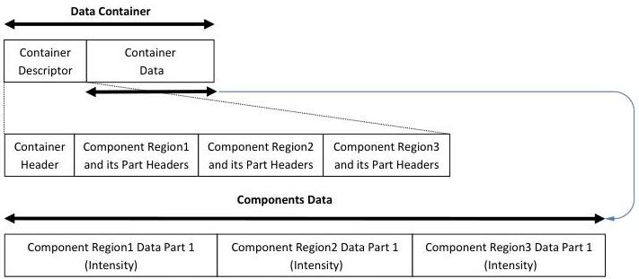

|  GENICAM |   | emva  |
| --- | --- | --- |
|  Version 1.1.0 | GenDC  |   |

### B.10 2D Image with multiple regions

2D image Container including 3 regions of Intensity Component. The Components have one region each located at a different X-Y offset and are of different sizes but have all the same source and Timestamp.

2D Images with Regions

Figure 5-13: 2D Image with Regions (Intensity)