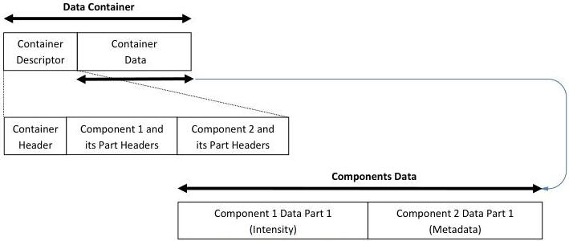

|  GENICAM |   | emva  |
| --- | --- | --- |
|  Version 1.1.0 | GenDC  |   |

### B.11 2D Image (monochrome Intensity Component with metadata)

A 2D image Container including one Intensity Component of one data Part and one Metadata Component of one data Part (e.g. GenICam Chunk data).

2D Image with metadata

Figure 5-14: 2D Image (intensity with metadata)