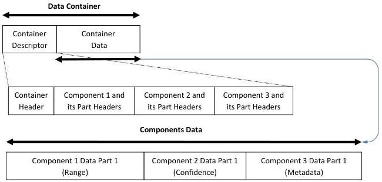

|  GENICAM |   | emva  |
| --- | --- | --- |
|  Version 1.1.0 | GenDC  |   |

### B.12 3D Scene with metadata (Range, Confidence, Metadata)

3D scene Container including 2 image Components of one data Part each and the Metadata associated to that scene. The 3 Components have different pixel formats.

3D Scene with metadata (Range, Confidence, Metadata)

Figure 5-15: 3D Scene (range, confidence and metadata)