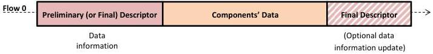
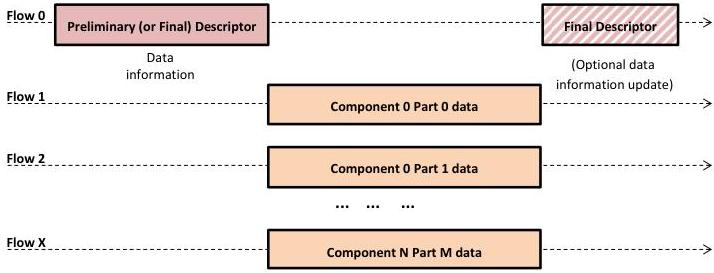

|  GENICAM |   | emva  |
| --- | --- | --- |
|  Version 1.1.0 | GenDC  |   |

## Appendix C GenDC Container typical transmission scenarios

This appendix presents some possible scenarios on how GenDC Container could be transmitted on various TLs (for illustration purpose only). Those scenarios are not part of the GenDC Container format definition itself since this specification only target to describe what the Container content is and to be Transport Layer agnostic on the way how it is transported.

### C.1 GenDC Container typical streaming using single and multiple data Flows

#### Typical GenDC Data Container Transmission using Flows:

(Linear or parallel transmission of one Container including multiple Components)

#### GenDC Container and single Flow transport:

#### Typical GenDC Container and multiple Flows Transport:

Figure 5-16: Typical GenDC Container's transmission using TL data Flows (One Container including multiple Components)