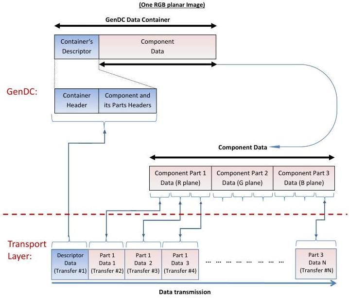

### C.2 GenDC Container typical transmission using in order transfers

Typical GenDC Data Container layout and transmission order:

Figure 5-17: Typical GenDC Container's layout and transmission order (One RGB planar image)