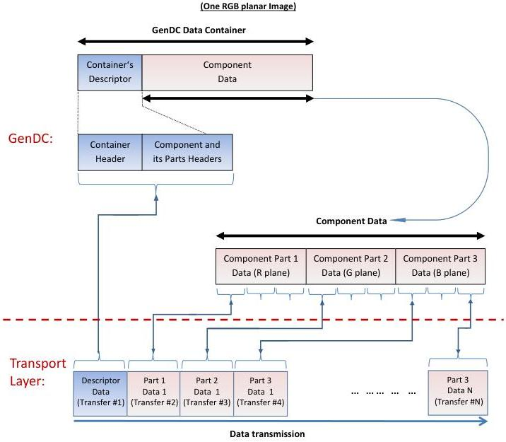

|  GENICAM |   | emva  |
| --- | --- | --- |
|  Version 1.1.0 | GenDC  |   |

### C.3 GenDC Container typical transmission using out of order transfers

Typical GenDC Data Container layout and out of order transmission:

Figure 5-18: Typical GenDC Container's layout and out of order transmission (One RGB planar image)