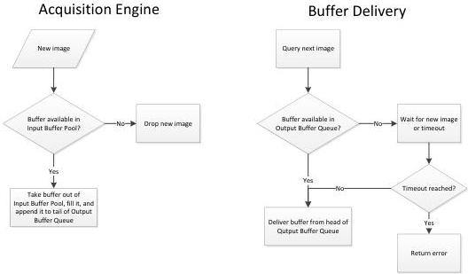

|  GEN<i>CAM |   | emva  |
| --- | --- | --- |
|  Version 1.2.0 | GenTL Standard Features Naming Convention  |   |

|  Category | BufferHandlingControl  |
| --- | --- |
|  Level | Mandatory  |
|  Interface | IEnumeration  |
|  Access | Read(/Write)  |
|  Unit | -  |
|  Visibility | Beginner  |
|  Values | OldestFirst (Mandatory) OldestFirstOverwrite NewestOnly Default (Deprecated)  |

Available buffer handling modes of this Data Stream.

Figure 3-3.1: Buffer handling mode "OldestFirst"

- OldestFirst (Mandatory): The application always gets the buffer from the head of the Output Buffer Queue (thus, the oldest available one). If the Output Buffer Queue is empty, the application waits for a newly acquired buffer until the timeout expires.

When data for a new buffer is available, the acquisition engine looks for any available buffer in the Input Buffer Pool, fills it, and appends it to the tail of the Output Buffer Queue. If the Input Buffer Pool is empty, the new data is dropped.